# ai-chat-app(React + TypeScript + Vite + SCSS + Redux + Router)

### How to use the app

- Once the app is launched, you can visit it at [http://localhost:3000](http://localhost:3000).
- Upon launching the app, a new chat named **New Chat** is automatically created, allowing the user to interact with the application directly.
  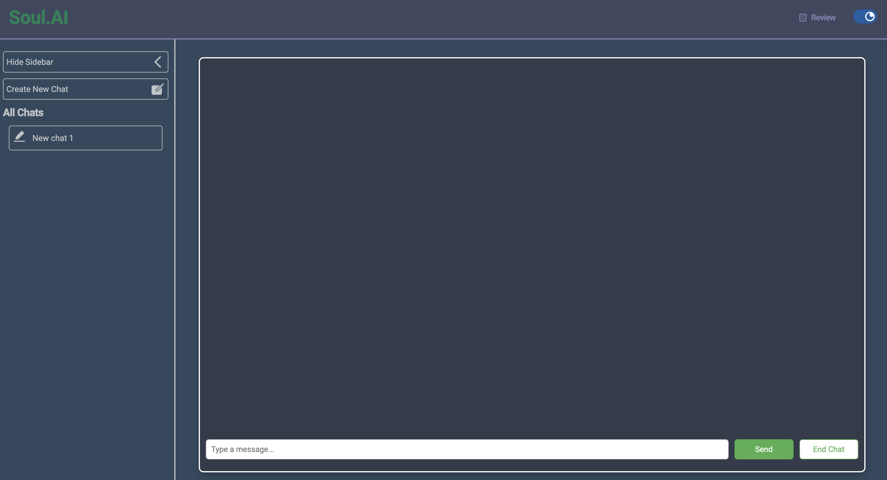
- Users can utilize the **input** field to type queries and use the send button to **send** messages.

- When a user sends a message, a mock **GPT simulated API** on my local **Express backend server** at [http://localhost:5100](http://localhost:5100).
  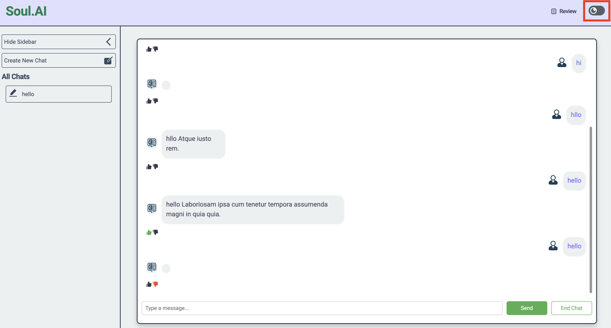
- Express server will give sentence as response [generated by faker.js]

- Every **3rd response will be failure response** and it will be **notify error** to the user.
  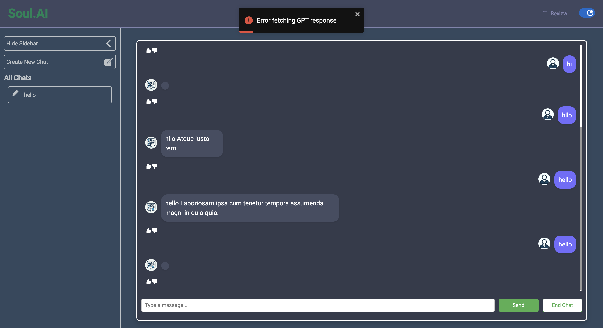
- Users have the option to **like or dislike** the responses they receive from the bot.
  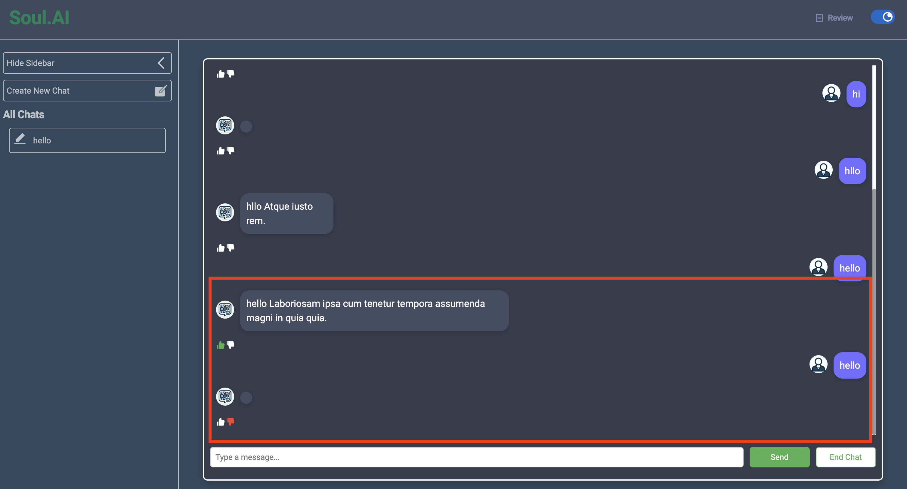
- User having two theme (dark/light) option
  
- An **End Conversation** button is available to conclude the conversation. Clicking on it triggers a **feedback modal** where the user can provide a rating and input feedback. After submitting the feedback, the conversation is **marked as ended**. However, users can revisit it at any time and can **continue chat**.
  
- Displaying **feedback**
  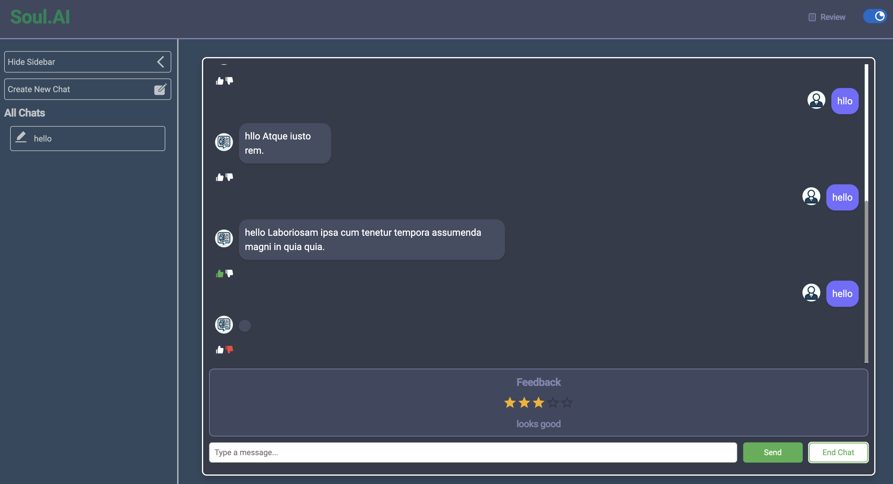
- On feedback modal by click **open new chat** user can create a initiate a new chat as well.
- A side panel on the left displays all available chats, and users can create a new chat using the **Create New Chat** button at the top of the side panel. and also possible when side panel has been closed.
  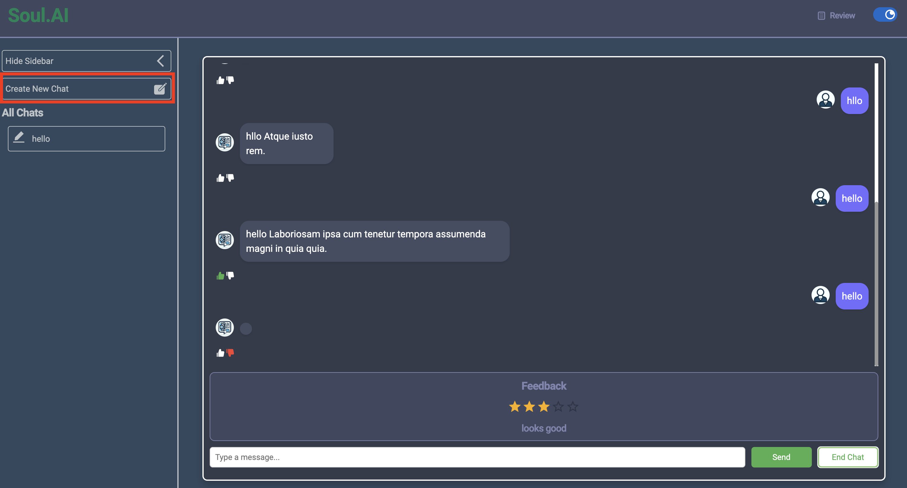
  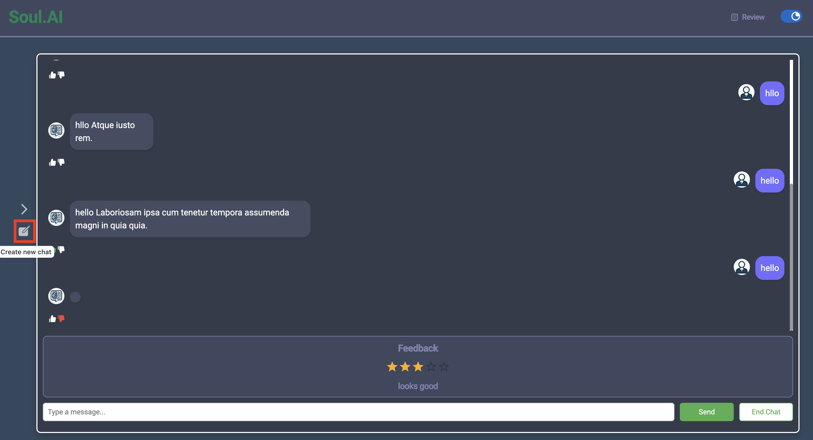
- From the Side panel user can do **Show and Hide** Side Panel
  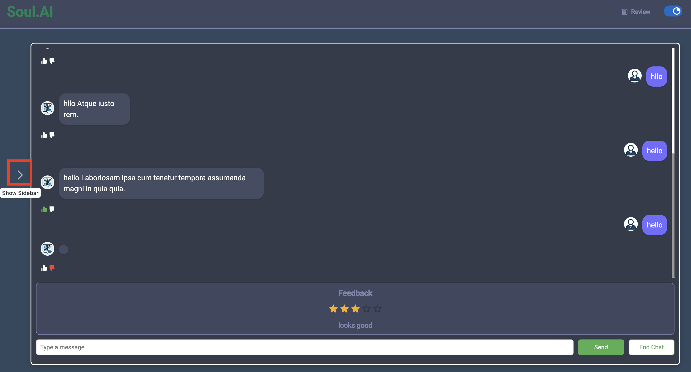
  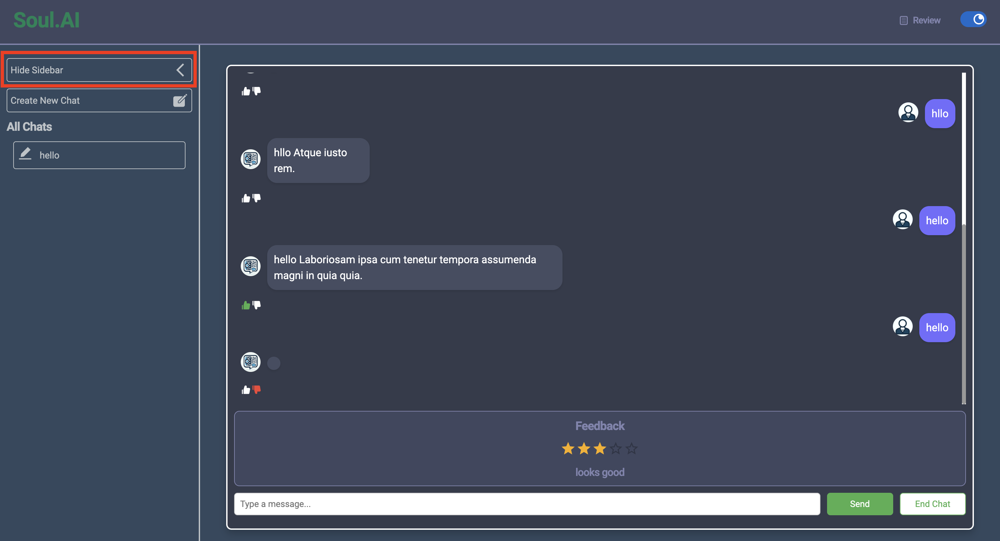
- Additionally, there is a feedback page accessible through the navigation at the top of the page.
  
  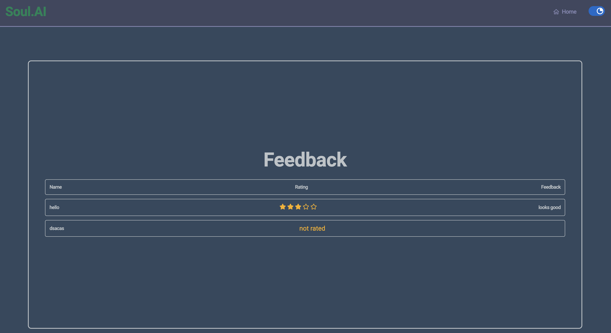
- On the feedback page, a table lists all conversations (both rated and unrated). This list is rendered in a sorted fashion by default, eliminating the need for users to manually sort it each time.
- Initially chat name will be **New chat** , when user will be send first message Chat name will be update automatically (it will take words from user message)
- User can update chat name any time from side panel by clicking dedicated **Changed Name** icon
  _Steps are_
  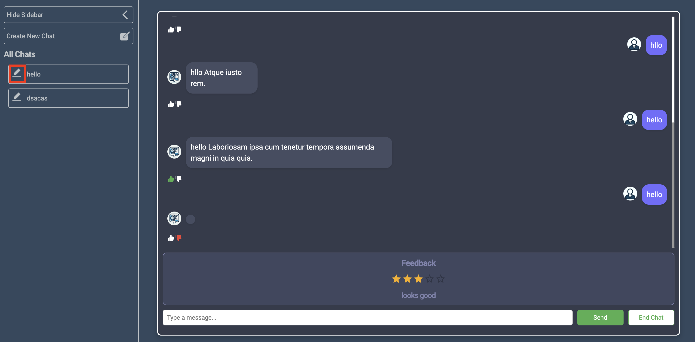
  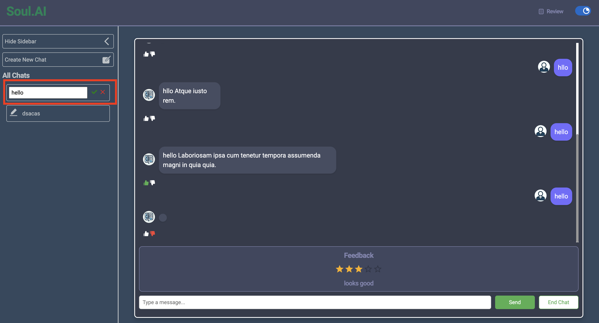
   --> **Chat Name will be updated**
   --> **Cancel the chat name update changes**
- Make **Responsive** for Mobile device
  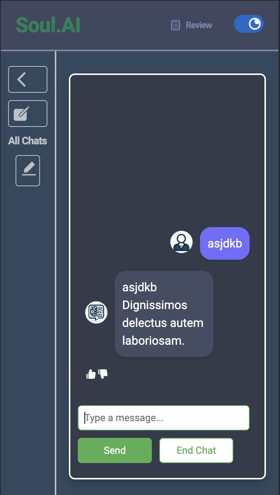

### Trade-Off/Technical Choices

- I used Redux as store management tool to handle all data in one place. I tried to built it in a very simple way.
- Router use to manage navigation and all.
- I used a Simple Express Server To Generate Simulated message.
- Used SASS to Style over the project it's help me to less write style.
- Rect-icon user for icon
- Used some MUI joy component to make more compact full enhanced UI
- The theme design is completely own approach.
